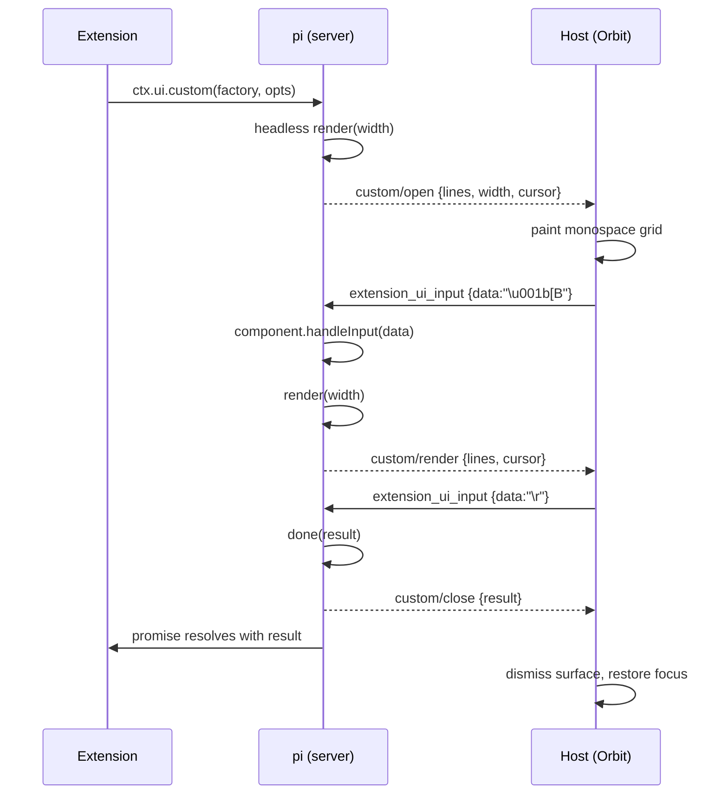

# Upstream proposal: render `ctx.ui.custom()` over RPC

**Status:** draft for pi (`@earendil-works/pi-coding-agent`)
**Reference host:** Orbit (`crates/orbit-rpc`, `crates/orbit-pi`)
**Reference server patch:** `contrib/pi-custom-ui-rpc/` (idempotent `apply.mjs` +
`custom-ui-handler.js`) — validates this contract end to end on a stock install.
**Touches:** `dist/modes/rpc/rpc-mode.js`, `dist/modes/rpc/rpc-types.ts`

## 1. Summary

RPC mode stubs `ctx.ui.custom()` to `undefined`, so any extension that builds a
TUI component — a selector, wizard, or multi-step prompt — silently does
nothing in any RPC host (Orbit, IDEs, SDK embeddings). This proposal adds a
streaming `custom` sub-protocol to the existing extension-UI channel, with one
guiding rule:

> **The server owns layout and emits final ANSI lines. The client is a
> renderer plus an input translator.**

That keeps the host contract small (render lines, forward keystrokes) while
letting *any* component — including overlays — work without the host knowing a
single pi-tui type.

## 2. Motivation

Concrete failure, reproducible on stock pi:

```
$ pi --mode rpc --approve --session-dir /tmp/.s
{"id":"p1","type":"prompt","message":"/review"}   # pi-review's /review

UI_REQ notify {"method":"notify","message":"Review cancelled","notifyType":"info"}
```

`pi-review`'s handler reaches `ctx.hasUI` (which is `true` in RPC), builds its
review-preset selector with `ctx.ui.custom(...)`, and gets `undefined`
instantly — because `rpc-mode.js` hardcodes:

```js
async custom() {
    // Custom UI not supported in RPC mode
    return undefined;
}
```

The same wall blocks every extension whose primary interaction is a custom
component: `questionnaire`, `summarize`, `handoff`, `qna`, plan-mode's
selectors, overlay-based tools. The docs already list these as TUI-only
(`docs/extensions.md`, "Mode comparison"), but the fix is cheap enough that it
deserves a protocol slot.

## 3. Current state

| Method | RPC today |
|---|---|
| `select`, `confirm`, `input`, `editor` | ✅ request/response over `extension_ui_request` |
| `notify`, `setStatus`, `setTitle`, `set_editor_text` | ✅ fire-and-forget |
| `setWidget` (string array) | ✅ fire-and-forget |
| `setWidget` (component factory) | ❌ dropped |
| `setFooter`, `setHeader`, `setEditorComponent` | ❌ no-op |
| **`custom`** | ❌ returns `undefined` |

All of the ❌ rows share one underlying capability: render a `Component` to
lines and (for `custom`) route input to it. Provide that once and every row
becomes implementable.

## 4. Design goals / non-goals

**Goals**

- A component's `render(width): string[]` output and `handleInput(data)` are
  the entire cross-boundary contract.
- No component reimplementation in hosts; unknown/new components just work.
- Deterministic input encoding so any host can drive any component.
- Discoverable capability so hosts can feature-detect.

**Non-goals**

- Native/structured rendering of pi-tui components (see §11 Alternative A).
- Pixel-perfect terminal emulation. The server composites; the client paints.
- Supporting `setFooter`/`setHeader`/`setEditorComponent` in this proposal
  (same machinery, separate follow-up).

## 5. Protocol design

The existing extension-UI sub-protocol is extended in both directions. Nothing
existing changes shape.

### 5.1 Server → client: render frames

`method: "custom"` is a new member of `RpcExtensionUIRequest`, keyed by `id`.
It has three phases.

**Open** — one component now owns the surface; the first frame rides along:

```json
{
  "type": "extension_ui_request",
  "id": "3f2c…",
  "method": "custom",
  "phase": "open",
  "lines": ["┌ Select a review preset ───────┐", "│ Review uncommitted changes    │", "└───────────────────────────────┘"],
  "width": 33,
  "height": 10,
  "cursor": { "row": 1, "col": 2 },
  "keyboard": "legacy",
  "mouse": false,
  "overlay": false
}
```

**Render** — subsequent frames, fire-and-forget (sent whenever the component
calls `tui.requestRender()`, coalesced to one frame per animation tick):

```json
{ "type": "extension_ui_request", "id": "3f2c…", "method": "custom",
  "phase": "render", "lines": ["…"], "width": 33, "cursor": { "row": 4, "col": 0 } }
```

**Close** — `done(result)` was called; the promise may now resolve:

```json
{ "type": "extension_ui_request", "id": "3f2c…", "method": "custom",
  "phase": "close", "result": "uncommitted" }
```

`result` is arbitrary JSON (`custom<T>`), including `null`/boolean/object.

### 5.2 Client → server: input, resize, cancel

Input is a stream, not a one-shot answer, so it is a **new command** rather
than an `extension_ui_response`:

```json
{ "type": "extension_ui_input", "id": "3f2c…", "data": "u" }
{ "type": "extension_ui_input", "id": "3f2c…", "data": "\u001b[B" }
```

Resize (the host's chosen viewport, in terminal cells):

```json
{ "type": "extension_ui_resize", "id": "3f2c…", "width": 100, "height": 24 }
```

Programmatic cancel reuses the existing response shape:

```json
{ "type": "extension_ui_response", "id": "3f2c…", "cancelled": true }
```

### 5.3 Capability discovery

Add a `capabilities` object to the existing `get_state` response (no new
command):

```json
{ "type": "response", "id": "s1", "command": "get_state", "success": true,
  "data": {
    "capabilities": {
      "extension_ui": ["select", "confirm", "input", "editor",
                       "notify", "setStatus", "setWidget", "setTitle",
                       "set_editor_text", "custom"]
    }
  } }
```

A host that sees `custom` may rely on the full §5 contract; a host that does
not must keep today's fallback (treat `custom` as unavailable). This also lets
Orbit light up its UI only when the running pi supports it, rather than
trial-and-error.

## 6. Lifecycle and concurrency



- **One custom surface per id; multiple ids may be open** (e.g. a wizard opens a
  nested selector). The host stacks or rejects them as it sees fit, but pi must
  key everything by `id`.
- `custom` blocks the *extension*, not the agent: the promise resolves only on
  `done`/cancel, exactly as in TUI mode. `waitForIdle`/abort semantics are
  unchanged.
- Cancel path: `extension_ui_response {cancelled:true}` rejects/resolves the
  promise with `undefined` (matching TUI `hideOverlay`/`restoreEditor`), and pi
  calls `component.dispose?.()`.
- If the host never sends an initial `extension_ui_input`/`resize`, the
  component simply stays at its initial frame — safe by default.

## 7. Input encoding contract

`handleInput(data)` already expects raw terminal bytes, so hosts send terminal
sequences. To make this testable, pin the required subset:

| Input | Bytes |
|---|---|
| printable | UTF-8 |
| Enter | `\r` |
| Escape | `\x1b` |
| Tab / Shift+Tab | `\t` / `\x1b[Z` |
| Backspace | `\x7f` |
| Delete | `\x1b[3~` |
| Arrows | `\x1b[A` `\x1b[B` `\x1b[C` `\x1b[D` |
| Home / End | `\x1b[H` / `\x1b[F` |
| PageUp / PageDown | `\x1b[5~` / `\x1b[6~` |
| Ctrl+letter | `letter & 0x1f` (e.g. Ctrl+C = `\x03`) |
| Alt/Option+x | `\x1b` + `x` |
| Paste | `\x1b[200~` … `\x1b[201~` |

**Optional, advertised in the open frame:**

- `"keyboard": "kitty"` — the host may send Kitty CSI-u sequences (and key
  release events for components with `wantsKeyRelease`). Default is `"legacy"`.
- `"mouse": true` — the host may send SGR mouse reports
  (`\x1b[<b;x;yM`/`m`); components receive them via `handleMouse`.

Hosts are not required to emit more than the required subset; components that
depend on Kitty/mouse should degrade gracefully (the same way they do under a
dumb terminal today).

## 8. Cursor, width, and overlays

- **Cursor / IME.** Components emit `CURSOR_MARKER` (`\x1b_pi:c\x07`) when
  focused. pi strips it before sending and reports the position structurally as
  `cursor: {row, col}` (0-based). The host places its hardware cursor / IME
  candidate window there. Absent `cursor` means "no cursor".
- **Width / height.** The host owns the viewport. It sends `width`/`height`
  once on open (or immediately after) and again on resize; pi re-renders at that
  width. pi must never assume the terminal's dimensions — there is no terminal.
- **Overlays.** `custom({overlay:true})` is supported **server-side**: pi's
  headless renderer tracks overlays and composites them into the final `lines`
  at the requested anchor/margin/visibility. The host sees only a frame, so it
  needs no overlay API. `onHandle` works because the handle is server-side.
  This is the main reason the server-composites rule matters.

## 9. Security

- The server **must emit only SGR** (colors/attributes) in `lines`; cursor
  movement, `clear`, OSC (title, Clipboard OSC 52, hyperlinks, images) are out
  of contract because the server has already laid the frame out. A host SHOULD
  strip any non-SGR control sequence it receives.
- `CURSOR_MARKER` is stripped server-side and reported as `cursor`, never as
  raw APC in `lines`.
- `lines` are otherwise untrusted presentation; hosts should never execute or
  interpret them beyond styling.

## 10. Compatibility and ecosystem migration

- `ctx.mode` stays `"rpc"`; `ctx.hasUI` stays `true`. `custom` simply stops
  returning `undefined`.
- The docs' guard guidance becomes: use `ctx.mode === "tui"` only for
  *unimplemented* TUI features; `custom` is available in `"tui"` and `"rpc"`
  and returns `undefined` in `"print"`/`"json"`. (Or: keep
  `ctx.hasUI && await ctx.capabilities.extension_ui.includes("custom")`.)
- `pi-review`, `questionnaire`, etc. gate on `ctx.hasUI` or on nothing, so they
  start working with zero changes. Extensions that over-guard with
  `mode === "tui"` need a one-line relaxation; that is a docs/migration note,
  not a protocol concern.
- Because capability discovery is opt-in (`get_state.capabilities`), no
  existing host breaks: a host that ignores `custom` frames never receives
  them, and a server that lacks the field is treated as pre-`custom`.

## 11. Alternatives considered

**A. Structured component tree (JSON).** Serialize `Container`/`Text`/
`SelectList`/… as JSON and reimplement each in GPUI. Rejected: extensions build
arbitrary components (`class MyOverlayComponent extends …`), so this can never
be complete, and it duplicates pi-tui's layout in every host.

**B. Full terminal emulation of the TUI.** Run interactive mode behind a PTY and
scrape the screen. Rejected: heavyweight, fragile, and throws away the existing
structured RPC channel.

**C. Server-rendered line stream (chosen).** Smallest host contract, complete
for arbitrary components, and overlays/cursor compose naturally because the
server already owns layout.

**D. Per-extension shims.** Patch `pi-review` to use `select`. Rejected as a
general solution: it fixes one extension and leaves the class broken.

## 12. Reference host checklist (Orbit)

Orbit is unusually well-positioned: it already parses SGR into styled runs
(`crates/orbit-pi/src/widgets.rs`) and links `alacritty_terminal` 0.26 for the
terminal panel.

1. **Capability gate** — read `get_state.capabilities`; enable `/review` and
   other custom-UI affordances only when `custom` is present.
2. **Surface** — add a `CustomUi` modal entity: a monospace grid that renders
   `lines` via the existing SGR parser; stack by `id`; own focus while open.
3. **Input** — translate GPUI `KeyDownEvent` → §7 bytes; send
   `extension_ui_input`. Reuse the terminal panel's key encoder, which already
   produces xterm sequences.
4. **Resize** — send `extension_ui_resize` with the card's column/row budget.
5. **Cursor** — map `cursor {row,col}` to GPUI's IME/hardware-cursor position.
6. **Close/cancel** — dismiss on `custom/close`; send `cancelled:true` on
   Escape/outside-click and restore composer focus.

## 13. Staged rollout

| Milestone | Scope | Host work |
|---|---|---|
| **M0** | `setWidget`/`setFooter`/`setHeader` component factories rendered to lines (read-only, re-emit on repaint) | none — reuses the line renderer |
| **M1** | `custom`, non-overlay, required input subset, cursor, close/cancel | modal grid + key encoder |
| **M2** | overlays (server-composited), Kitty keyboard, mouse | optional input modes |

M0 alone unblocks status widgets built as components; M1 unblocks `/review`,
wizards, and selectors. Each milestone is independently shippable.

> **Status:** M1 is implemented and verified on a patched pi — `/review` opens
> its selector, arrow keys move the highlight, resize re-renders, `done()`
> resolves the extension's promise, and cancel rides the existing
> `extension_ui_response` path. The reference patch is
> `contrib/pi-custom-ui-rpc/`. Server-side overlay compositing (M2) is also
> implemented (anchors, margins, widths, offsets, ANSI-aware cell slicing), so
> §8's "the server composites" rule now holds; Kitty keyboard and mouse remain
> open, as does component-factory `setWidget` (M0).

## 14. Appendix — minimal schema

```ts
// RpcExtensionUIRequest additions
type CustomFrame = {
  type: "extension_ui_request";
  id: string;
  method: "custom";
  phase: "open" | "render" | "close";
  lines?: string[];              // open/render
  width?: number;                // open/render, terminal cells
  height?: number;               // open
  cursor?: { row: number; col: number };  // open/render, 0-based
  keyboard?: "legacy" | "kitty"; // open
  mouse?: boolean;               // open
  overlay?: boolean;             // open
  result?: unknown;              // close
};

// RpcCommand additions (client → server)
type ExtensionUiInput  = { type: "extension_ui_input";  id: string; data: string };
type ExtensionUiResize = { type: "extension_ui_resize"; id: string; width: number; height: number };
```

Suggested implementation seams in pi:

- `rpc-mode.js` — replace the `custom` stub (`createExtensionUIContext`) with a
  headless render driver; keep component instances in a `Map<id, …>`.
- `rpc-types.ts` — extend `RpcExtensionUIRequest` and `RpcCommand`.
- Reference behavior: `interactive-mode.js` `showExtensionCustom()` (overlay vs
  editor-replacement, `dispose`, result plumbing).
